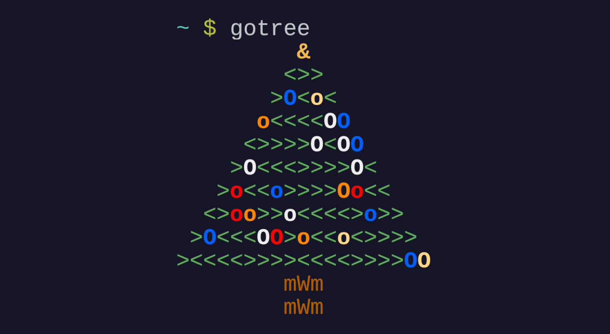

<h1 align="center">gotree</p>
<p align="center">Terminal christmas tree in Go</p>

<p align="center">
	<a href="./LICENSE">
		
	</a>
	<a href="https://github.com/LordOfTrident/gotree/issues">
		
	</a>
	<a href="https://github.com/LordOfTrident/gotree/pulls">
		
	</a>
	<br><br><br>
	
</p>

## Table of contents
* [Introduction](#introduction)
* [Quickstart](#quickstart)
* [Customization](#customization)
* [Bugs](#bugs)
* [Make](#make)

## Introduction
A remake of my [ltree](https://github.com/LordOfTrident/ltree) in Go.

## Quickstart
```sh
$ make
$ make install
$ gotree
```

## Customization
See `gotree -h` for a list of customization flags

## Bugs
If you find any bugs, please create an issue and report them.

## Make
Run `make all` to see all the make rules.
